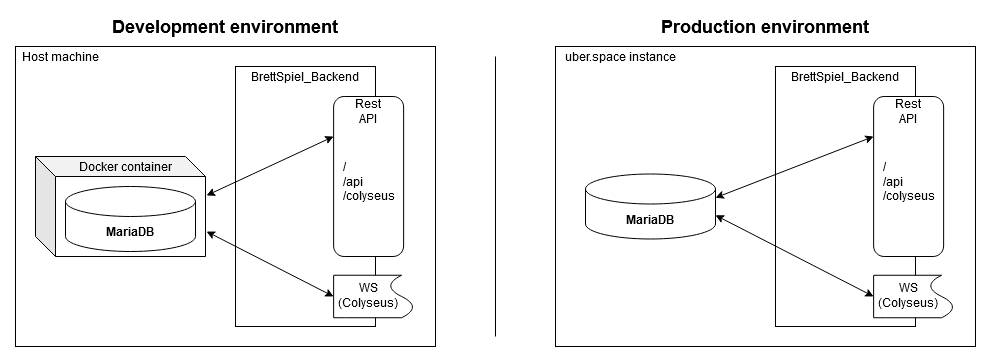

# BrettSpiel_Backend

Backend to host both CRUD operations for the databse via an HTTP-API and the Colyseus game server.
Running the server will require a running database for full functionallity. The Repository uses MariaDB which is supplied
through the docker container found under the docker directory.

### Environment


## Getting started

Running the backend requires docker. Install ```Docker Desktop``` for windows and ```docker``` on unix.

Building the docker container that hosts the predefined MariaDB:
```
cd <project root>/docker
docker build -t mariadb:<tag number> .
```

Running the container (anywhere):
```
docker run -p 3306:3306 mariadb:<tag number>
```

Access MariaDB inside the container:
Note: The root password is found in the ```<project root>/docker/Dockerfile```
```
exec -it <container id | container name> bash
mysql -u root -p
```

After starting the container, the MariaDB is accessable for external tools on 127.0.0.1:3306.

## Schema
Each time a new container is build, a new database is set up. This sets up a default database called ```BrettSpiel```.
After generating the database, a predefined script is executed to fill the database with a sensible schema 
( ```<project root>/docker/Dockerfile``` ). If the desired schema changes, this file needs to be altered.

# Contributing
This section deals with coding helps, remarks and auxiliary information.

### Logging
The new logging framework we added is used nearly identical to the normal logging we already did.
However we are now able to use all log levels one would expect by calling the console like this:

````
console.debug('foo'); //  [11:46:35] [debug] foo
console.log('foo'); //    [11:46:35] [log] foo
console.info('foo'); //   [11:46:35] [info] foo
console.warn('foo'); //   [11:46:35] [warn] foo
console.error('foo'); //  [11:46:35] [error] foo
console.line('foo'); //   foo
````

Logs will now also be saved in a directory named ``logs``. At the moment this will need to be cleaned by hand.


